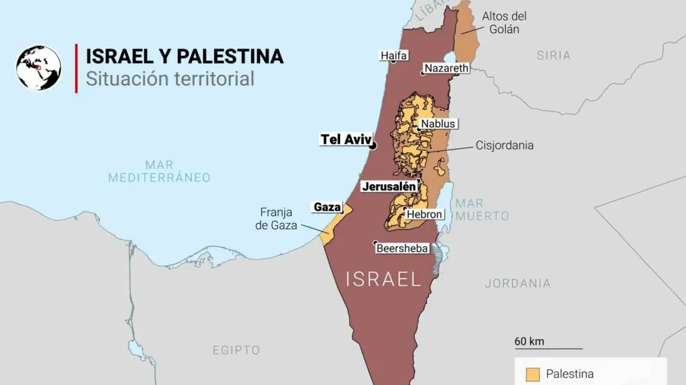

# La guerra de palestina
### Un conflicto que perdura desde hace muchos años

Para comprender las raíces de este problema, es necesario retroceder hasta 1947, incluso más allá. El caso de Israel encierra una triste paradoja. Por un lado, el Estado de Israel existe porque una resolución de Naciones Unidas le concede el derecho de existir. Es el primer Estado moderno creado de esta manera. Por el otro, el Estado de Israel no deja de vulnerar sistemáticamente todas y cada una de las resoluciones de esa misma organización que le dio la vida y que le reconoció la legitimidad de su existencia.
